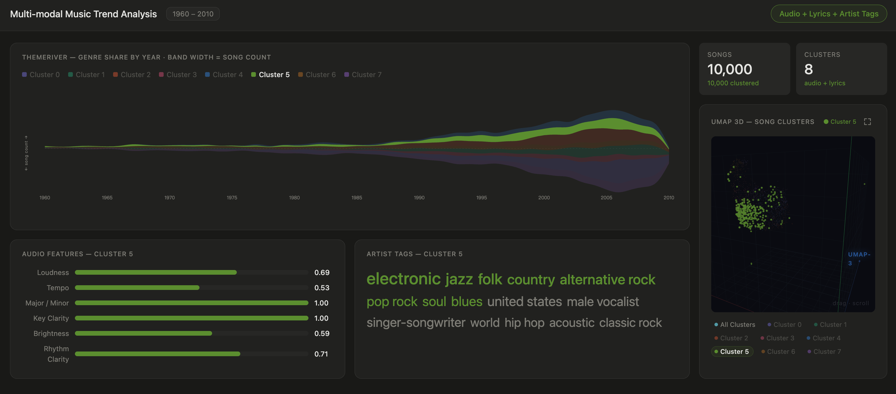
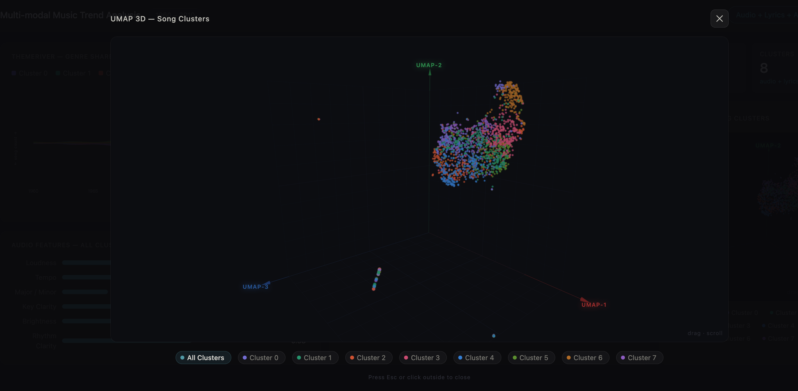

# Multi-modal Music Trend Analysis

An interactive visualization dashboard exploring how music genres evolved from 1960 to 2010. Built on a 10,000-track subset of the Million Song Dataset (MSD), fused with musiXmatch lyrics, and clustered in a learned latent space.




---

## How it works

```
Raw data (MSD + musiXmatch)
        │
        ▼
  ML pipeline (Python)
  ├── Merge & preprocess three modalities: acoustic features, lyrics, artist tags
  ├── Train a tri-modal VAE → 32-dim shared latent space
  ├── KMeans clustering → 8 genre clusters
  └── UMAP 3D projection → spatial layout for visualization
        │
        ▼
  Import script → MongoDB
        │
        ▼
  Backend API (Node / Express)
        │
        ▼
  Frontend dashboard (React + D3 + Three.js)
```

The ML results are already committed to this repo. You don't need to re-run the pipeline to launch the app.

---

## Quick start

### Prerequisites

- Node.js ≥ 18
- Python ≥ 3.9
- A running MongoDB instance (local or remote)

### 1 — Configure the database connection

Copy the example env file and edit it if needed:

```bash
cp backend/.env.example backend/.env
```

Default values (`mongodb://127.0.0.1:27017`, database `music_trend`) work out of the box with a local MongoDB.

### 2 — Import data into MongoDB

```bash
pip install -r backend/requirements.txt
python backend/scripts/import_data.py
```

This reads the committed ML outputs and loads them into two MongoDB collections:
- `music_trend.songs` — 10,000 track records with cluster labels and UMAP coordinates
- `music_trend.visualization_cache` — pre-aggregated data for each dashboard panel

Expected output:
```
Imported 10000 songs into 'music_trend.songs'
Upserted 4 cache docs into 'music_trend.visualization_cache'
```

### 3 — Start the backend (Terminal 1)

```bash
cd backend
npm install
npm run dev
```

Runs at `http://localhost:8000`. Verify with `http://localhost:8000/api/health`.

### 4 — Start the frontend (Terminal 2)

```bash
cd client
npm install
npm run dev
```

Open `http://localhost:5173` in your browser.

---

## Dashboard panels

| Panel | What it shows |
|---|---|
| **ThemeRiver** | Genre share by year — band width = song count for that cluster |
| **UMAP 3D Scatter** | All 10K songs in 3D latent space, coloured by cluster. Drag to orbit, scroll to zoom, click to select a cluster, ↗ to go fullscreen |
| **Audio Features** | Per-cluster means of 6 acoustic features (loudness, tempo, mode, key clarity, brightness, rhythm clarity) |
| **Artist Tags** | Most distinctive genre tags per cluster, ranked by TF-IDF across clusters |

All panels are linked — selecting a cluster anywhere highlights it everywhere.

---

## ML pipeline (reference)

> Skip this section if you just want to run the app. All outputs are already in `ml/results/` and `data/processed/`.

The pipeline lives in `ml/` and runs in four steps:

### Step 1 — Data preparation

```bash
cd ml
python data_merge.py       # joins MSD acoustics with musiXmatch lyrics
python data_preprocess.py  # cleans and encodes all three modalities
```

**Acoustic features** (39 dims): loudness, tempo, mode, timbre, pitch, etc. — standardised with `StandardScaler`.

**Lyric features** (→ 50 dims): bag-of-words counts from musiXmatch, stop-word filtered, TF-IDF weighted, then compressed with `TruncatedSVD`.

**Artist tags** (100 dims): top-100 corpus tags encoded as a multi-hot binary vector.

### Step 2 — Tri-modal VAE

```bash
python train_vae.py
```

A Variational Autoencoder with three modality-specific encoders (acoustic, lyric, tags) fuses all inputs into a shared **32-dimensional latent space**. Each track is represented by its deterministic mean vector `μ`. This forces the model to find a unified representation that captures style, sound, and genre simultaneously.

Output: `results/latent_vectors.npy` — shape `(10000, 32)`.

### Step 3 — Clustering

```bash
python cluster.py           # auto-selects K via Silhouette score
python cluster.py --k 8     # or fix K directly
```

Sweeps K ∈ {4, …, 10} and picks the K that maximises the Silhouette score (cosine distance) on a 2,000-point sample. KMeans is then run with 20 restarts to avoid poor local minima. **K = 8** was selected.

Output: `results/cluster_labels.npy`, `results/msd_clustered.csv`.

### Step 4 — UMAP + visualisation

```bash
python visualize.py
```

Projects the 32-dim latent vectors into 3D via UMAP (PCA pre-reduction to 50 dims for speed). The 3D coordinates are cached in `results/umap_coords_3d.npy` so subsequent runs are instant.

---

## Project structure

```
.
├── data/
│   ├── msd_subset.csv              raw MSD acoustics (10K tracks)
│   ├── mxm_dataset_train/test.txt  musiXmatch bag-of-words lyrics
│   └── processed/                  preprocessed arrays (.npy) + transformers
│
├── ml/
│   ├── data_merge.py
│   ├── data_preprocess.py
│   ├── train_vae.py
│   ├── cluster.py
│   ├── visualize.py
│   └── results/                    VAE weights, latent vectors, cluster labels, UMAP coords
│
├── backend/
│   ├── scripts/import_data.py      one-time MongoDB import
│   ├── src/server.js               Express API
│   └── .env.example
│
└── client/
    ├── src/
    │   ├── App.jsx                 dashboard (React + D3 + Three.js)
    │   └── api.js                  fetches /api/bootstrap from backend
    └── vite.config.js              proxies /api/* → localhost:8000
```

---

## Tech stack

| Layer | Tech |
|---|---|
| ML | Python · PyTorch · scikit-learn · UMAP · Pandas |
| Database | MongoDB |
| Backend | Node.js · Express |
| Frontend | React 18 · Vite · D3.js v7 · Three.js |
